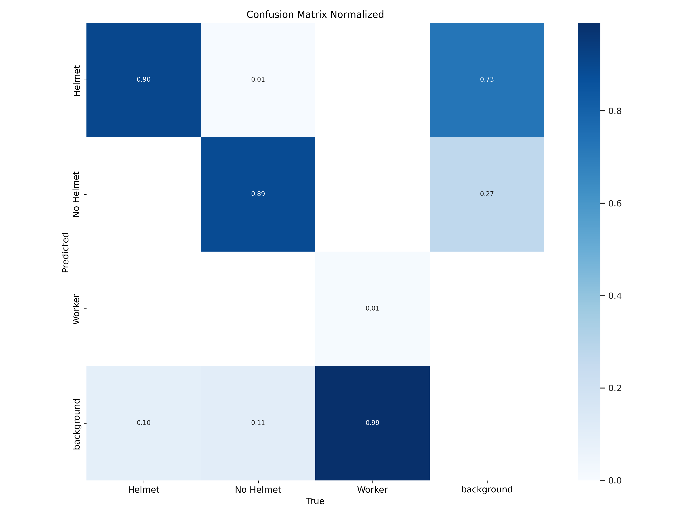
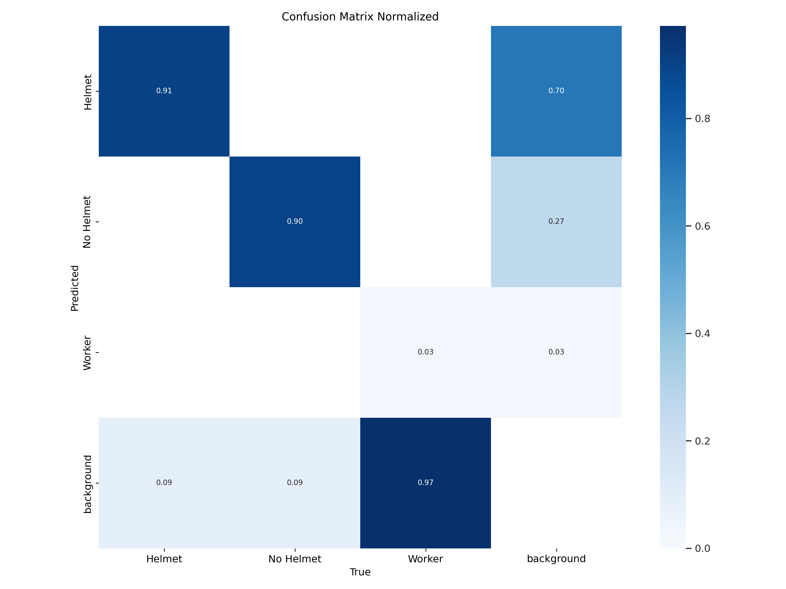
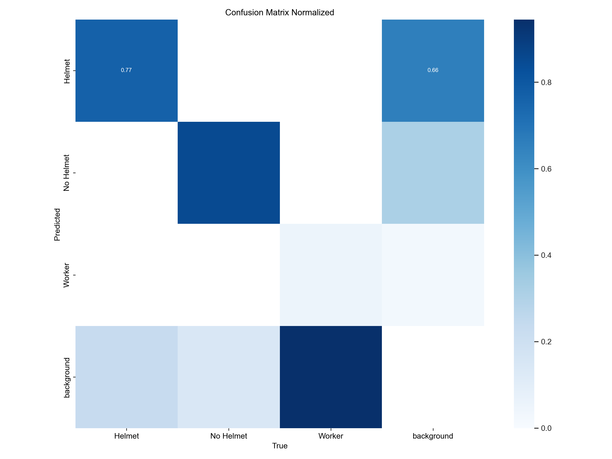

## SAFETY HELMET DETECTION(Using YOLOv8) 👷‍♂️

In industrial and construction settings, worker safety is paramount. This project develops a real-time safety helmet detection system using the YOLOv8 deep learning model, known for its efficiency and accuracy. The main objective of this project is to create an automated system that can accurately identify whether workers are wearing safety helmets in real-time video streams and detect the people who are not wearing safety helmets.

## DATASET:🗂️

The image dataset for training this model was collected from various sources and converted to the appropriate file type. It was then passed through several preprocessing and augmentation steps (e.g., horizontal flipping) using Roboflow. The final dataset contains nearly 28,000 images and is available at [Dataset](https://www.kaggle.com/datasets/archisman24/new-dataset?select=new+dataset). The dataset is divided into 3 parts, training, validation and test sets and contained 3 classes : Helmet, No Helmet, and Worker (with varying levels of representation in the dataset).
For more information on the dataset, visit my [website](https://archismansengupta.site/safetyhelmetdetection).


## STEPS INVOLVED:✅

1. Install all the necessary packages used for this project, using the command : ` pip install -r requirements.txt`.

2. The model was trained for 3 different epochs, i.e. for 30, 50 and 100 epochs, to achieve the best performance from the model. The model was trained using CLI commands in Jupyter Notebook as follows:

```python
# Training YOLOv8 model for 30 epochs:
!yolo task=detect mode=train model=yolov8n.pt data="../new dataset/data.yaml" epochs=30 imgsz=640 batch=16

# Training YOLOv8 model for 50 epochs:
!yolo task=detect mode=train model=yolov8n.pt data="../new dataset/data.yaml" epochs=50 imgsz=640 batch=16

# Training YOLOv8 model for 100 epochs:
!yolo task=detect mode=train model=yolov8n.pt data="../new dataset/data.yaml" epochs=100 imgsz=640 batch=16
```

 Here’s a breakdown of each part:

- `!yolo`: This exclamation mark indicates the start of a shell command in some environments, like Jupyter notebooks.
- `task=detect`: Specifies that the task is object detection.
- `mode=train`: Indicates that the model should be in training mode.
- `model=yolov8n.pt`: Specifies the model to use for training, in this case, the YOLOv8 nano model, which is a lightweight version. This model is trained on the COCO dataset and is the fastest among the other pre-trained models. We can also train our model from scratch if we want.
- `data="../new dataset/data.yaml"`: Points to the dataset configuration file (`data.yaml`) that contains information about the dataset, such as paths to the training and validation images and class labels.
- `epochs=30`: Specifies the number of training epochs, which is the number of times the training algorithm will work through the entire training dataset.
- `imgsz=640`: Sets the image size to 640 pixels. This means images will be resized to 640x640 pixels before being fed into the model.
- `batch=16`: Sets the batch size to 16, meaning 16 images will be processed in each iteration of training.

3. After training the model, we look at the different model metrics to get an idea of the model’s performance. The model metrics are stored in the `runs` folder and can be viewed in the Jupyter Notebook. We can also perform a model validation using a similar command as mentioned below:

```python
# Validating the model on the best.pt model:
!yolo val model='../new dataset/data.yaml" imgsz=640 batch=16 conf=0.4
```

4. After training and validating the model, the next step is to test the model on the test dataset. Now, we can do this in two ways:

```python
# Using CLI:
!yolo task=detect mode=predict model='../best.pt' conf=0.5 source='Sample media/sample_video.mp4' save=True

# Using Python command:
from ultralytics import YOLO
model = YOLO('../best.pt')
model.predict('sample/sample_video_1.mp4', save=True, conf=0.55, agnostic_nms=True)
```

The above steps can be performed to make predictions on the test dataset or on any media file. Using the [crop image](modules/crop%20image.ipynb) file, we can also extract the cropped images from the predictions based on the classes specified.

5. The model is now ready for deployment and used for other applications. [Safety Helmet Detection Using Webcam](Safety%20Helmet%20Detection%20using%20Webcam.py) is designed to detect safety helmets in real-time video streams using a pre-trained YOLOv8 model. The script captures video from a webcam, processes each frame to detect whether workers are wearing safety helmets, and displays the results with annotations. In case, it finds workers without a safety helmet, it displays a warning message on the screen.


**Note:**
- In case, you want to train the model on your own custom dataset, along with following the above steps mentioned, you can use [xml2yolo](modules/xml2yolo.ipynb) file to convert the files to yolo format in case the source dataset is in xml format and can use [split dataset](modules/split_dataset.ipynb) and [Changing names](modules/Changing%20names.py) to split the dataset into train, test and validation datasets and changing the names of the data files respectively.

- The complete code for training and validating the model can be found in my [Kaggle Notebook](https://www.kaggle.com/code/archisman24/safety-helmet-detection-using-yolov8/notebook).

## RESULTS:📈

Many benchmark results and confusion matrices are automatically created by the YOLOv8 model on completion of training and validation. These results can be found in the `runs` folder. We will look and analyze these benchmarks in the following section :

1. **Confusion Matrix :** The normalised confusion matrices for the models trained on different epochs are shown below: (shown for validation). It provides a detailed breakdown of the predictions made by the model and compares them to the actual outcomes. It becomes clear from the following plots that with the increase in epochs, the model is able to accurately identify workers without safety helmet, and the number of true positives increases and false positives decrease. Also, it becomes clear from the plot that the 'worker' classification was not accurate as most of the time the model identified it as background.(This happened due to the fact the 'Worker' class was underrepresented in the dataset).
<center>
    
    <h3>Confusion Matrix for 30 Epochs</h3>
</center>

<center>
    
    <h3>Confusion Matrix for 50 Epochs</h3>
</center>

<center>
    
    <h3>Confusion Matrix for 100 Epochs</h3>
</center>


2. **Precision Curve :** The Precision Curve for the models trained on different epochs are shown below:(shown for validation). This is a graphical representation of precision values at different thresholds. This curve helps in understanding how precision varies as the threshold changes. It shows the accuracy of the detected objects, indicating how many detections were correct. 


<center>
    
    <h3>Precision Curvre for 30 Epochs</h3>
</center>

<center>
    
    <h3>Precision Curvre for 50 Epochs</h3>
</center>

<center>
    
    <h3>Precision Curvre for 100 Epochs</h3>
</center>


3. **Recall Curve :** The Recall Curve for the models trained on different epochs are shown below:(shown for validation). This graph illustrates how the recall values change across different thresholds. It describes the ability of the model to identify all instances of objects in the images. From the curves, its visible that with the increase in the number of epochs, the recall of the model improves significantly, for a purticular confidence threshold.


<center>
    
    <h3>Recall Curvre for 30 Epochs</h3>
</center>

<center>
    
    <h3>Recall Curvre for 50 Epochs</h3>
</center>

<center>
    
    <h3>Recall Curvre for 100 Epochs</h3>
</center>


4. **P-R Curve :** The P-R Curve for the models trained on different epochs are shown below:(shown for validation). It is an integral visualization for any classification problem, as this curve showcases the trade-offs between precision and recall at varied thresholds. It becomes especially significant when dealing with imbalanced classes. It can be seen that for the increase in the number of epochs, the area under the P-R curve increases, thus pointing to the improved Precision and Recall of the model.


<center>
    
    <h3>P-R Curvre for 30 Epochs</h3>
</center>

<center>
    
    <h3>P-R Curvre for 50 Epochs</h3>
</center>

<center>
    
    <h3>P-R Curvre for 100 Epochs</h3>
</center>


5. **F1 Curve :** The F1 Curve for the models trained on different epochs are shown below:(shown for validation). Interpreting this curve can offer insights into the model's balance between false positives and false negatives over different thresholds. As the epoch increases, so does the F1 value, most significantly for the 'No Helmet' class.

<center>
    
    <h3>F1 Curvre for 30 Epochs</h3>
</center>

<center>
    
    <h3>F1 Curvre for 50 Epochs</h3>
</center>

<center>
    
    <h3>F1 Curvre for 100 Epochs</h3>
</center>

To know more about the benchmark results and how they compare against each other, visit my [website](https://archismansengupta.site/safetyhelmetdetection). 


## AREAS OF APPLICATIONS:🔨
The development of a real-time safety helmet detection system using the YOLOv8 deep learning model has several significant applications across various industries. Here are some key areas and related real-world use cases:
1. **Construction Sites**
- Hazard Detection: Ensuring that all workers are wearing safety helmets to prevent head injuries from falling objects, machinery, or debris.
- Compliance Monitoring: Automating the monitoring of safety compliance to adhere to occupational safety regulations and reduce the risk of penalties.
- Incident Analysis: Recording and analyzing video footage to review compliance and investigate incidents.
2. **Manufacturing and Industrial Plants**
- Machine Safety: Ensuring workers near heavy machinery are protected with helmets, reducing the risk of injuries from mechanical failures or accidents.
- Safety Audits: Automating safety audits to continuously monitor helmet usage without the need for manual checks.
- Emergency Response: Quickly identifying workers not wearing helmets during emergency situations to prioritize rescue efforts.
3. **Mining Operations**
- Underground Safety: Monitoring helmet usage in underground mines where the risk of head injuries is high due to low ceilings and heavy equipment.
- Remote Monitoring: Using real-time video feeds to monitor remote and hazardous areas where direct supervision is challenging.

The real-time safety helmet detection system not only enhances worker safety but also contributes to operational efficiency, regulatory compliance, and overall risk management in various industrial and construction settings.

## FUTURE WORK:

- Will train other Image Processing models(like CNN models using Tensorflow, PyTorch, etc) and compare their accuracies.

- A face recognition model can be incorporated with the safety helmet detection system to identify workers who are not wearing helmets by matching their identities through a database.

## REFERENCES:

- [**Ultralytics Docs**](https://docs.ultralytics.com/) - Home page of the Ultralytics library.
